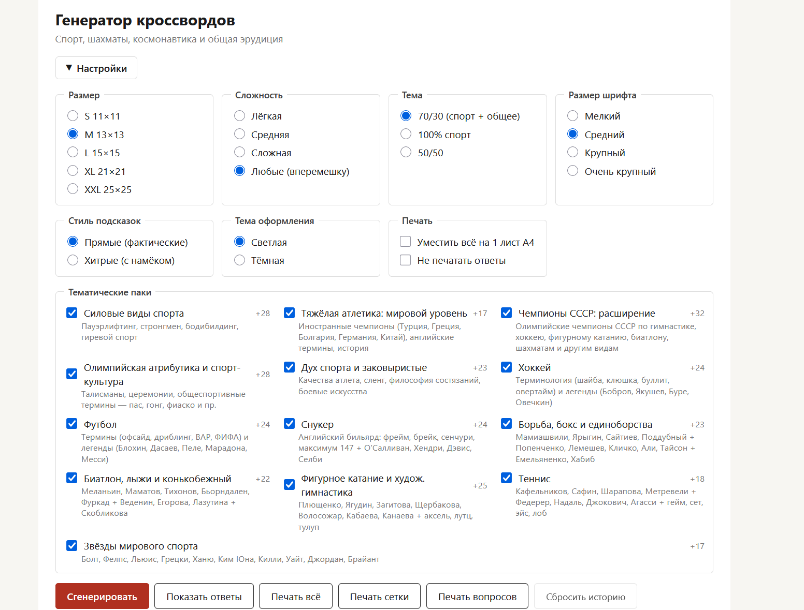
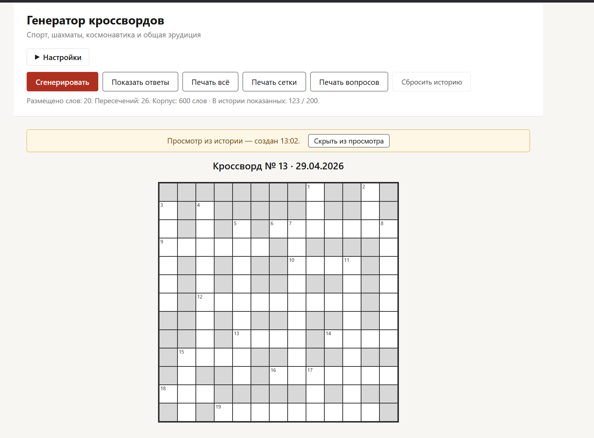

# printable-crosswords-gen

> Печатный кроссворд за 3 секунды. Pet-проект: офлайн-генератор русских кроссвордов с настраиваемым корпусом и режимом «хитрых» подсказок.

🟢 **Демо со встроенным корпусом (спорт + эрудиция):** https://andromanpro.github.io/printable-crosswords-gen/
🟢 **Чистая версия (конструктор без корпуса):** https://andromanpro.github.io/printable-crosswords-gen/index-empty.html



---

## Зачем

Сделан для одного решающего; делюсь как есть. Тематика корпуса — спорт и общая эрудиция, потому что таков был интерес.

В репо две версии:
- **`index.html`** — со встроенным корпусом 600 слов на тему спорта/эрудиции. Демо.
- **`index-empty.html`** — то же ядро, но без корпуса. Подключаешь свой через UI («+ Загрузить свой пак») или собираешь с нуля в редакторе («✎ Редактор корпусов» → «+ Новый пак»). Полезно если темы автора тебе не близки.

Алгоритм тематически нейтрален — корпус и движок отделены.

## Возможности

- **Размеры сетки:** S 11×11, M 13×13, L 15×15, XL 21×21, XXL 25×25.
- **Сложность:** лёгкая / средняя / сложная / любые (с балансировкой по сложности).
- **Стиль подсказок:** *прямые* (фактические описания) и *хитрые* (метафоры, прозвища, образы).
- **Тематические паки** — включаемые/отключаемые группы слов в UI.
- **Печать на A4:**
  - «Печать всё» — стандартная (сетка → вопросы → ответы отдельной страницей).
  - «Печать сетки» — только сетка без вопросов.
  - «Печать вопросов» — только вопросы крупным шрифтом 18pt в одну колонку (читать рядом с сеткой).
- **Размер шрифта:** мелкий / средний / крупный / очень крупный — для читателей с разным зрением.
- **Тёмная тема** для экрана; печать всегда на белом независимо от выбора.
- **История кроссвордов** — последние 50 в `localStorage`. Можно открыть старый, посмотреть ответы.
- **«Не повторять»** — генератор запоминает последние 200 вопросов и старается давать новые.

## Как пользоваться

1. Скачать репозиторий или клонировать.
2. Открыть `index.html` двойным кликом — откроется в браузере (Edge / Chrome / Firefox).
3. Раскрыть «▶ Настройки», выбрать параметры.
4. Нажать «Сгенерировать».
5. Распечатать одной из трёх кнопок печати (`Ctrl+P` тоже работает).



Никаких сборок, серверов, `npm install`. Vanilla HTML/JS/CSS, всё работает с `file:///`.

## Свой корпус слов

Есть два способа подключить свой пак.

### Способ 1: через UI (без правки HTML)

1. Раскрой «▶ Настройки» → блок «Тематические паки».
2. Внизу — кнопка **«+ Загрузить свой пак»** → выбери `.js`-файл по образцу ниже.
3. Пак появляется в списке с пометкой «свой» и красной полоской слева. Можно включать/выключать чекбоксом или удалить через `×`.

Сохраняется в `localStorage` — между сессиями не пропадает.

### Способ 2: положить файл в `data/` и подключить в HTML

Подходит, если форкнул репо и собираешь свою сборку с нуля.

- `data/words.js` — базовый корпус.
- `data/pack-*.js` — тематические паки, подключаются `<script>`-тегами в `index.html`.

### Формат пака

Создай файл `pack-literature.js`:

```js
(function () {
  'use strict';
  const ID = 'literature';
  const words = [
    {
      id: "lit_pushkin",
      word: "ПУШКИН",
      clue: "Александр Сергеевич, «солнце русской поэзии».",
      expertClues: [
        "Тот, кто стрелялся с Дантесом.",
        "Лицеист, чьё имя — Лицей.",
        "Создатель Татьяны Лариной."
      ],
      theme: "general",       // weightlifting | sport | general
      difficulty: 1,          // 1 = знают все, 2 = знатоки, 3 = специалисты
      len: 6,
      tags: ["surname"]
    }
    // ...
  ];
  window.CW = window.CW || {};
  CW.PACKS = CW.PACKS || {};
  CW.PACKS[ID] = {
    id: ID,
    name: 'Литература',
    description: 'Русская и мировая классика, авторы и герои',
    words
  };
})();
```

**Для способа 1**: сохрани файл и загрузи через кнопку в UI.

**Для способа 2**: положи файл в `data/` и подключи в `index.html` рядом с другими `<script src="data/pack-...">`:

```html
<script src="data/pack-literature.js?v=33"></script>
```

После любого способа — обнови страницу (`Ctrl+F5`). Пак появится в списке и автоматически включится.

**Правила формата:**
- `word` — заглавными буквами, **без буквы Ё** (заменена на Е), без пробелов и дефисов. Это стандарт российских кроссвордов.
- `clue` — одно предложение, заглавная буква, точка в конце; никогда не равно слову или его части.
- `expertClues` — массив из 2-3 «хитрых» формулировок (опционально). При повторе слова при генерации показывается случайная.
- `id` — уникальный, стабильный. После добавления слова не переименовывать (сломает историю «не повторять»).

Чтобы заменить базовый корпус, отредактируй `data/words.js` напрямую.

## Алгоритм

Жадная вставка с RNG-seed-рестартами:

1. Сортируем пул слов по убыванию длины, внутри длины — shuffle с RNG.
2. Стартовое слово (самое длинное) кладём через центр сетки.
3. Идём по списку: для каждого слова находим все валидные пересечения с уже размещёнными буквами и выбираем лучшее по скорингу (пересечения × 10 − расстояние до центра).
4. Делаем 30 попыток с разными seed'ами, выбираем лучшую сетку (по числу размещённых слов и пересечений).
5. Финализация: пустые клетки → блоки, нумерация по правилам кроссворда.
6. **Проверка на «паразитные слова»** — если в сетке появилась случайная последовательность букв, не относящаяся ни к одному размещённому слову, попытка отбрасывается.

Эмпирика на корпусе ≈ 600 слов:

| Размер | Среднее число слов |
|--------|---------------------|
| 11×11  | ~13                 |
| 13×13  | ~17                 |
| 15×15  | ~24                 |
| 21×21  | ~45                 |
| 25×25  | ~59                 |

Производительность: ~3 мс на одну генерацию M-сетки на современном ноутбуке.

## Корпус-пример

В репо корпус 600 слов: спорт, тяжёлая атлетика, шахматы, космонавтика, общая эрудиция. 13 тематических паков. **170 слов имеют по 3 разных «хитрых» формулировки** — при повторе слова в новом кроссворде используется другая.

Фактчек проводился, но не 100%-й. PR с правками формулировок приветствуются.

## Структура проекта

```
printable-crosswords-gen/
├─ index.html             ← UI и подключение скриптов
├─ css/
│  ├─ ui.css              ← экранный стиль
│  └─ print.css           ← @media print, A4
├─ js/
│  ├─ data-loader.js      ← нормализация Ё→Е, фильтры темы/сложности, паки
│  ├─ rng.js              ← seedable PRNG (Mulberry32)
│  ├─ history.js          ← localStorage для «не повторять»
│  ├─ puzzles.js          ← история сгенерированных кроссвордов
│  ├─ grid.js             ← модель сетки и валидация размещения
│  ├─ generator-classic.js← алгоритм генерации
│  ├─ renderer.js         ← отрисовка в DOM
│  └─ app.js              ← связка UI с движком
└─ data/
   ├─ words.js            ← базовый корпус
   └─ pack-*.js           ← 13 тематических паков
```

## Стек

Vanilla JavaScript, HTML, CSS. Без бандлеров, без `node_modules`, без серверной части.

Работает локально через `file:///` или с любого http-сервера.

## Известные ограничения

- Размер L 15×15 при больших полях принтера может не уместиться на A4 — включите галочку *«Уместить всё на 1 лист A4»*.
- XL 21×21 и XXL 25×25 рассчитаны на A4 в книжной ориентации с *«Уместить»*, либо печатать в альбомной или на A3.
- В Firefox для печати фоновых блоков (закрашенные клетки) нужно вручную включить «Печать фонов».
- Корпус собран на исторический момент; некоторые ссылки на «текущих» атлетов могут устареть. Замени `expertClues` через `data/`-файлы.

## Лицензия

MIT — см. [LICENSE](LICENSE).

---

🌐 [androman.pro](https://androman.pro) · ✈ [Telegram](https://t.me/andromanpro1c)
